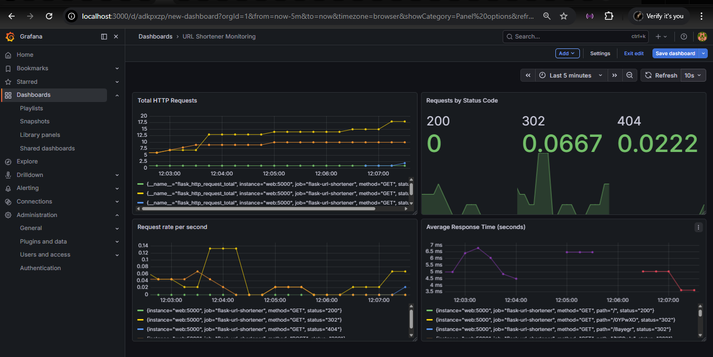
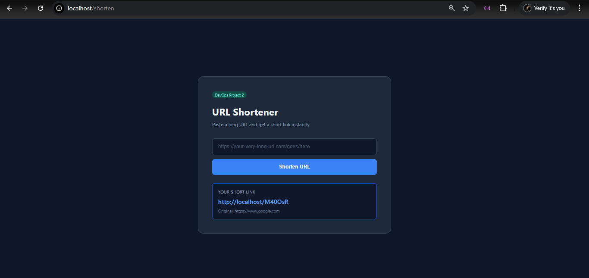

# URL Shortener — DevOps Project

A production-style URL shortener built with Python and Flask,
featuring a full multi-container architecture, live monitoring
dashboard, reverse proxy, and automated CI/CD pipeline.

## Screenshots

### Live Grafana monitoring dashboard


### URL shortener application


## Architecture

Five containers running together via Docker Compose,
connected through a private Docker network:
```
Browser → Nginx (port 80) → Flask app → Redis
                                ↓
                          Prometheus → Grafana (port 3000)
```

| Service    | Role                              | Image                  |
|------------|-----------------------------------|------------------------|
| Flask      | URL shortener application         | Built from Dockerfile  |
| Nginx      | Reverse proxy — public front door | nginx:alpine           |
| Redis      | Key-value database for URLs       | redis:7-alpine         |
| Prometheus | Metrics collection every 15s      | prom/prometheus:latest |
| Grafana    | Live monitoring dashboards        | grafana/grafana:latest |

## What this project demonstrates

- Multi-container Docker architecture with Docker Compose
- Container networking — services communicate by hostname
- Reverse proxy pattern with Nginx in front of Flask
- Redis as a persistent key-value store
- Production monitoring with Prometheus and Grafana
- PromQL queries for real-time metrics visualization
- Automated testing with pytest and mocking (no Redis needed)
- CI/CD pipeline with GitHub Actions
- Immutable Docker image tagging with git commit SHA
- GitHub Actions build cache for fast repeated builds
- GitHub Secrets for secure credential management

## How the CI/CD pipeline works

Every `git push` to `main` triggers the pipeline:

1. GitHub Actions spins up a fresh Ubuntu VM
2. Python 3.11 is installed
3. All 8 pytest tests run — Redis is mocked, no containers needed
4. If all tests pass, Docker Buildx builds the Flask image
5. Image is pushed to Docker Hub with two tags:
   - `latest` — most recent build
   - `abc1234` — exact git commit SHA for traceability
6. Build layers are cached in GitHub Actions for fast rebuilds

If any test fails the pipeline stops. Nothing gets deployed.

## Tech stack

- Python 3.11 · Flask · Redis · pytest · pytest-mock
- Docker · Docker Compose · Nginx
- Prometheus · Grafana · PromQL
- GitHub Actions · Docker Hub

## Running locally

**Prerequisites:** Docker Desktop installed and running
```bash
git clone https://github.com/senura-medagoda/url-shortener.git
cd url-shortener
docker-compose up -d --build
```

That single command starts all five containers.

| URL                     | What you see                        |
|-------------------------|-------------------------------------|
| http://localhost        | URL shortener app                   |
| http://localhost/health | Health check with Redis status      |
| http://localhost/metrics| Prometheus metrics endpoint         |
| http://localhost:3000   | Grafana dashboard (admin/admin123)  |

**Stop everything:**
```bash
docker-compose down
```

## Running the tests
```bash
python -m venv venv
venv\Scripts\activate        # Windows
pip install -r app/requirements.txt
pytest tests/ -v
```

Expected output:
```
test_home_page_loads                PASSED
test_shorten_url_success            PASSED
test_shorten_url_adds_https         PASSED
test_shorten_empty_url_returns_400  PASSED
test_redirect_existing_url          PASSED
test_redirect_nonexistent_code      PASSED
test_health_endpoint_redis_up       PASSED
test_health_endpoint_redis_down     PASSED

8 passed in 0.61s
```

## API endpoints

| Endpoint      | Method | Description                          |
|---------------|--------|--------------------------------------|
| `/`           | GET    | URL shortener web interface          |
| `/shorten`    | POST   | Accepts a URL, returns short link    |
| `/<code>`     | GET    | Redirects to original URL            |
| `/health`     | GET    | Health check including Redis status  |
| `/metrics`    | GET    | Prometheus metrics endpoint          |

## Docker Hub
```bash
docker pull senuramedagoda/url-shortener:latest
```

## Project structure
```
url-shortener/
├── images/
│   ├── grafana-dashboard.png
│   └── app-screenshot.png
├── app/
│   ├── app.py                Flask URL shortener
│   ├── requirements.txt      Python dependencies
│   └── templates/
│       └── index.html        Web interface
├── tests/
│   ├── __init__.py
│   └── test_app.py           8 automated tests with mocking
├── nginx/
│   └── nginx.conf            Reverse proxy configuration
├── prometheus/
│   └── prometheus.yml        Metrics scraping configuration
├── .github/
│   └── workflows/
│       └── ci.yml            GitHub Actions pipeline
├── Dockerfile                Flask container blueprint
└── docker-compose.yml        All 5 containers wired together
```